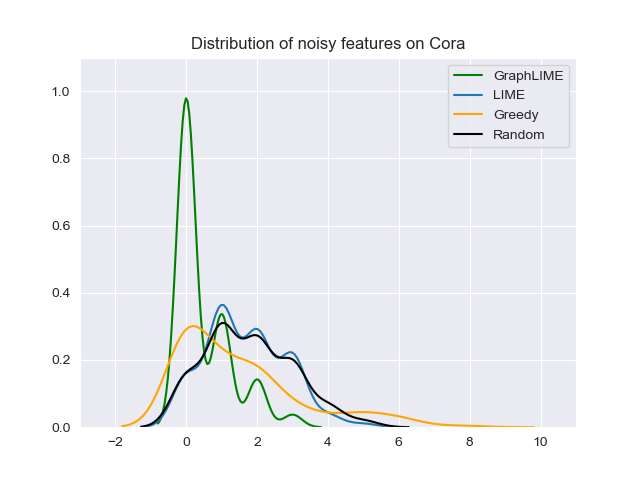
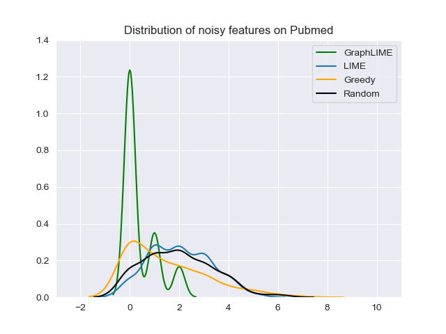

# GraphLIME

GraphLIME is a model-agnostic, local, and nonlinear explanation method for GNN. It uses Hilbert-Schmit Independence Criterion (HSIC) Lasso, which is a nonlinear interpretable model. More details can be seen in the [paper](https://arxiv.org/pdf/2001.06216.pdf).

This repo implements GraphLIME by using the awasome GNN library [PyTorch Geometric](https://github.com/rusty1s/pytorch_geometric), and reproduces the results of filtering useless features until now; that is, Figure 2 in the paper.

## Usage

This implementation is easy to use. All you need to do is to instantiate a `GraphLIME` object first, and then explain the specific node by `explain_node` method.

```python
from explainers import GraphLIME

# data  # a `Data` object
# model  # any GNN model
node_idx = 0  # the specific node to be explained

explainer = GraphLIME(mode, hop=2, rho=0.1)
coefs = explainer.explain_node(node_idx, data.x, data.edge_index)
```

`coefs` are the coefficients of features. It corresponds to the $beta$ in the paper. The larger the value is, more important the corresponding feature is.

## Reproduce

All scripts of different experiments are in `scripts` folder. You can reproduce the results by:

```
sh scripts/noise_features_cora.sh
```

## Results




## Requirements

* python 3.6
* torch 1.4.0
* torch-geometric 1.4.3
* numpy 1.17.2
* scikit-learn 0.21.3
* seaborn 0.10.1
* matplotlib 2.2.4

## Change Log

* 2020-05-26: first upload
