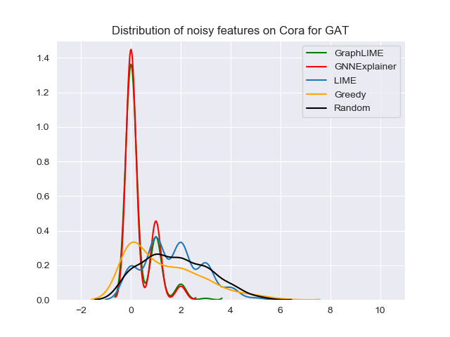
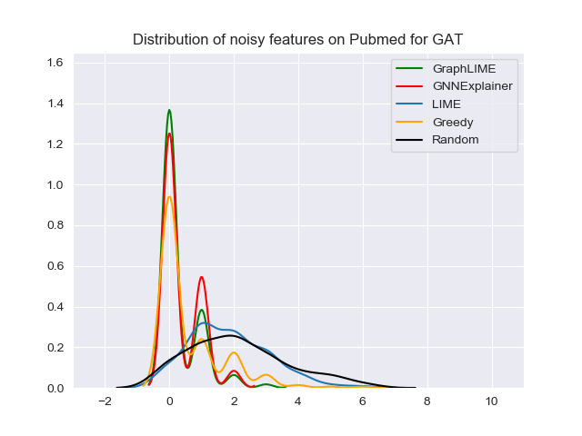

# GraphLIME

GraphLIME is a model-agnostic, local, and nonlinear explanation method for GNN. It uses Hilbert-Schmit Independence Criterion (HSIC) Lasso, which is a nonlinear interpretable model. More details can be seen in the [paper](https://arxiv.org/pdf/2001.06216.pdf).

This repo implements GraphLIME by using the awasome GNN library [PyTorch Geometric](https://github.com/rusty1s/pytorch_geometric), and reproduces the results of filtering useless features until now; that is, Figure 3 in the paper.

## Installation

Just use pip to install.

```
> pip install graphlime
```

## Usage

This implementation is easy to use. All you need to do is to confirm your model outputs log probability (for example, outputs by `F.log_softmax()`) first, and then instantiate a `GraphLIME` object, and finally explain the specific node by `explain_node` method.

```python
from graphlime import GraphLIME

data = ...  # a `torch_geometric.data.Data` object
model = ... # any GNN model
node_idx = 0  # the specific node to be explained

explainer = GraphLIME(model, hop=2, rho=0.1)
coefs = explainer.explain_node(node_idx, data.x, data.edge_index)
```

`coefs` are the coefficients of features. They correspond to the 𝜷 in the paper. The larger the value is, more important the corresponding feature is.

## Tutorial

Example and details can be found in `tutorial.ipynb`.

## Reproduce

All scripts of different experiments are in the `scripts` folder. You can reproduce the results by running the following command:

```
> sh scripts/noise_features_cora.sh
```

## Results

### Filter Unuseless Features

There are another 10 random features added to the original features and then we train a GNN model. We use several explanation methods to find out which features are important for the model. Then we plot the distribution of noise features selected by the explanation methods. Less noise features are better; that is, a peak around the origin is good.

<p float="middle">
  
  
</p>

## Requirements

* python >= 3.6
* torch >= 1.6.0
* torch-geometric 1.6.0
* numpy 1.17.2
* scikit-learn 0.21.3
* seaborn 0.10.1
* matplotlib 2.2.4

## Changing Log

* 2021-02-05: add a tutorial file
* 2021-01-10: modified the file structure & published to PyPI with version 1.2.0
* 2020-11-26: fixed bug
* 2020-11-09: fixed bug
* 2020-10-08: modified the file structure for publishing to PyPI
* 2020-05-26: first uploaded
